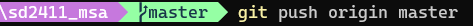
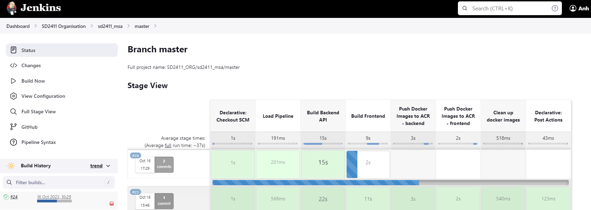
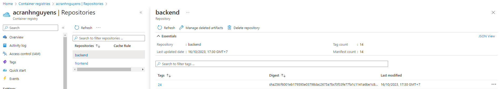
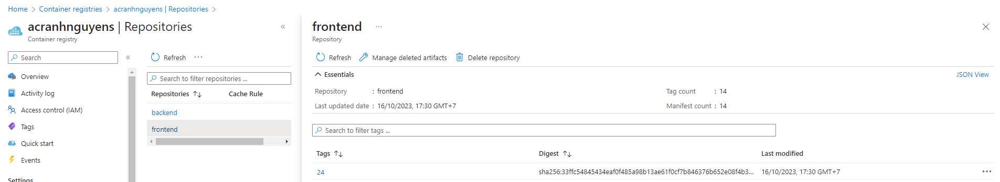

# SD2411 DEVOPS CI
## Reference Repositories
| Repository | Description |
|--|--|
|[sd2411_msa](https://github.com/sieunhantanbao/sd2411_msa)|**Application source code**. This contain a backend, frontend and use the mongo as database|
|[sd2411_devops_ci](https://github.com/sieunhantanbao/sd2411-devops-ci)|This contains the **Jenkins Groovy files** (Jenkins Shared Library). When the [sd2411_msa](https://github.com/sieunhantanbao/sd2411_msa) has changed the source code, it will call the Jenkins files in this repo to build the source code (CI process)|
|[sd2411_helm_charts](https://github.com/sieunhantanbao/sd2411-helm-charts)|This contains the **helm charts** definition and helm chart packages (manifest) to deploy the apps from the [sd2411_msa](https://github.com/sieunhantanbao/sd2411_msa)|
|[sd2411_azure_infrastructure](https://github.com/sieunhantanbao/sd2411_azure_infrastructure)|**Ops source code**. This contains the infrastructure as code (iac) to provision the Azure resources with terraform. This also handles the Continue Deployment (CD) with ArgoCD|

## Overview
Welcome to the SD2411 DEVOPS Continues Integration (CI) repository. This repository contains the Jenkins Groovy files to get, build the source code from the [SD2411_MSA Repository](https://github.com/sieunhantanbao/sd2411_msa) and then push the artifacts (docker images) to Azure Container Registry (ACR). The Continues Deployment (CD) process will be handled in the [SD2411 Azure Infrastructure Repository](https://github.com/sieunhantanbao/sd2411_azure_infrastructure).

## Key Features
- Auto build when the code changes are pushed into the master branch of the [SD2411_MSA Repository](https://github.com/sieunhantanbao/sd2411_msa).
- Use [Trivy](https://trivy.dev/) to scan security and vulnerabilities.
- Push the docker images (frontend, backend) to the Azure Container Registry (ACR).

## Setup Jenkins Organization Folder
### Prerequisites
- Azure Container Registry (ACR) is provisioned (see [Provision Azure Container Registry (ACR)](https://github.com/sieunhantanbao/sd2411_azure_infrastructure#provision-azure-container-registry-acr))
- Jenkins is installed in a Virtual Machine (see [Provision Virtual Machine (VMs)](https://github.com/sieunhantanbao/sd2411_azure_infrastructure#provision-virtual-machine-vms))
### Setup Jenkins Organization Job
Please refer to the [Setup_Jenkins_Pipeline_Use_Trivy.docx](https://github.com/sieunhantanbao/sd2411-devops-ci/blob/main/Setup_Jenkins_Pipeline_Use_Trivy.docx) for the details.

## Demonstration
- Push the change to the master branch of the [SD2411_MSA Repository](https://github.com/sieunhantanbao/sd2411_msa) 

- Jenkins job/pipeline is automatically triggered

- The build artifacts (docker images) are pushed to the ACR

